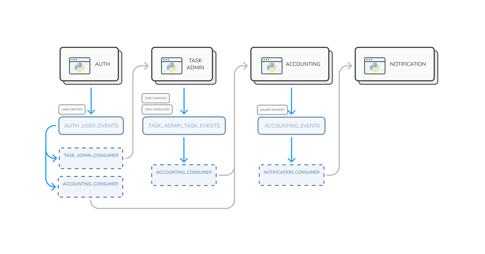

# Task Traker system


[](https://github.com/wemake-services/wemake-python-styleguide)


## Run
It is possible to run system with Docker Compose from the project root:
1. Images use default host and custom bridge network. To create bridge network, run:
```shell
docker network create -d bridge task-tracker-network
```
2. With created networks, next command will start everything:
```shell
docker-compose up --build
```

## Architecture overview
System consists of several python microservices, that store
data in PostgreSQL databases and communicate asynchronously through RabbitMQ.
For detailed discribtion look at `services/READ.me`.


The communication between services is asynchronous and goes through RabbitMQ queues.
The following scheme defines the connection of services with exchanges and queues:


## TODO
- [ ] Use user public id in all user endpoints
- [ ] Accounting system logic
- [ ] Dockerize Accounting
- [ ] Notification service
- [ ] Analytics service
- [ ] Env files
## TODO
- [ ] Use user pablic id in all user endpoints
- [ ] Accounting system logic
- [ ] Dockerize Accounting
- [ ] Notification service
- [ ] Analytics service
- [ ] Env files
